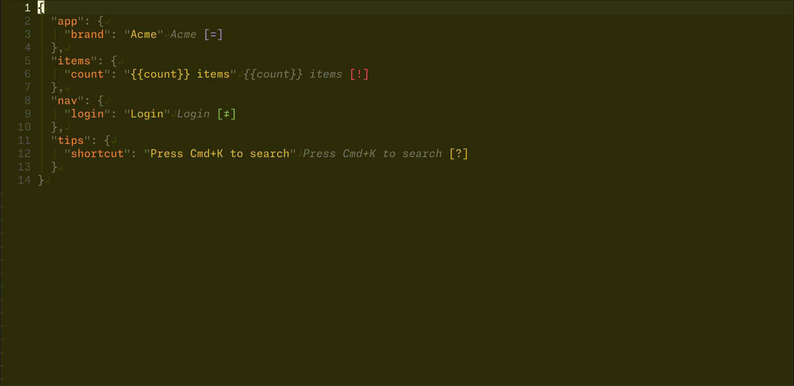
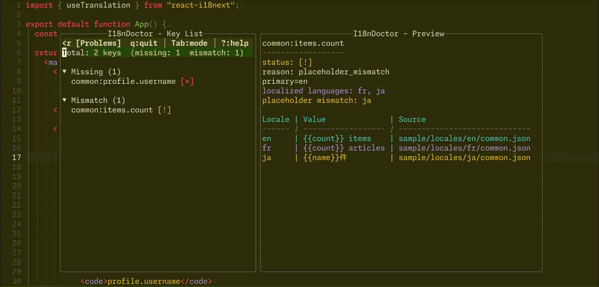
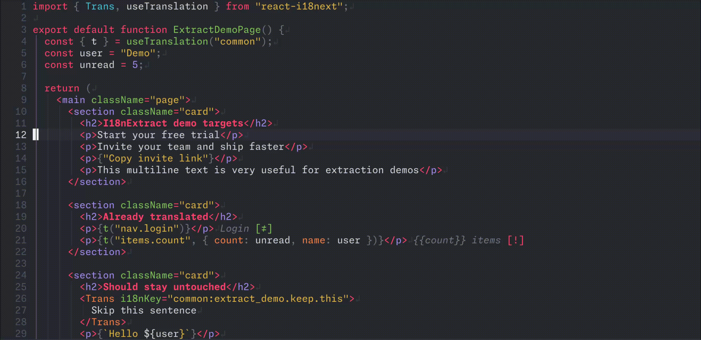
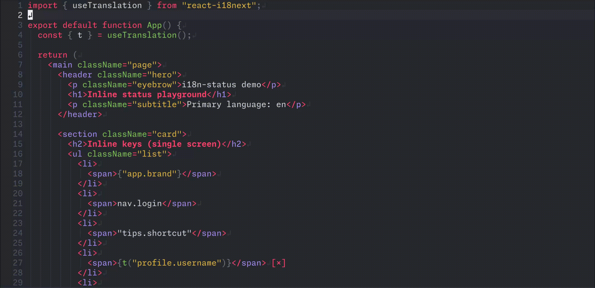

# 🌐 i18n-status.nvim

[](https://github.com/mhiro2/i18n-status.nvim/releases/latest)
[](https://github.com/mhiro2/i18n-status.nvim/actions/workflows/ci.yaml)

**Inline-first i18n status & review tooling for Neovim**
for **i18next / next-intl** projects

Stop guessing whether `t("login.title")` is safe.
See **i18n health inline**, inspect details on demand, and run safe edits.

## 👀 What you see (inline = status, not display)

```ts
t("login.title"): Login              [=]
t("login.description"): Welcome back [≠]
t("login.button"): Login             [?]
t("login.error"): {count} errors     [!]
t("signup.title"):                   [×]
```

| Marker | Meaning | When shown |
| ------ | ------- | ---------- |
| `[=]`  | All languages same | All languages exist and have identical values (may need translation) |
| `[≠]`  | Localized | All languages exist but values differ |
| `[?]`  | Fallback is used | Missing in some languages (but primary exists) |
| `[×]`  | Missing in primary | Primary language value is missing |
| `[!]`  | Placeholder mismatch | Placeholders differ between languages |

**Priority**: `×` > `!` > `?` > `≠` > `=`

Examples:
- `[=]`: `en: "Login"`, `ja: "Login"` (identical values - check if translated)
- `[≠]`: `en: "Welcome back"`, `ja: "おかえりなさい"` (both exist, localized values)
- `[?]`: `en: "Login"`, `ja: missing` (primary exists, other missing)
- `[×]`: `en: missing`, `ja: "サインアップ"` (primary missing)
- `[!]`: `en: "{count} items"`, `ja: "{name} 件"` (different placeholders)

## 🎬 Demo

<table>
  <tr>
    <th>Inline Status and Hover</th>
    <th>Inline Translation Preview and Language Switch (<code>:I18nLang</code>)</th>
  </tr>
  <tr>
    <td>
      
    </td>
    <td>
      
    </td>
  </tr>
  <tr>
    <th>blink.cmp Completion for i18n Keys</th>
    <th>Project Review and Diagnostics (<code>:I18nDoctor</code>)</th>
  </tr>
  <tr>
    <td>
      
    </td>
    <td>
      
    </td>
  </tr>
  <tr>
    <th>Extract Translations from JSX/Text (<code>:I18nExtract</code>)</th>
    <th>Add New Keys Across Locales (<code>:I18nAddKey</code>)</th>
  </tr>
  <tr>
    <td>
      
    </td>
    <td>
      
    </td>
  </tr>
</table>

## ✨ Features

- ✅ **Inline status**: Lightweight extmarks, quiet by design.
- 🗂️ **Translation file inline**: When you open a resource JSON file, show another language inline (controlled by `:I18nLang`).
- 💬 **Hover details**: Values for all languages + reason + file path (git-relative when possible).
- 🔁 **Language cycling**: yankround-style next/prev + "back to previous".
- 🎯 **Inline goto definition (opt-in)**: Map any keys (e.g. `gd`) to jump straight to the translation file under the cursor.
- 🩺 **Doctor + Review**: Diagnose project-wide issues and review/fix them in a two-pane floating UI where the left list drives every action and the right side stays as a live preview.
- ✂️ **Interactive JSX extraction**: Detect hardcoded JSX text, then extract it with per-item prompts that show text preview, jump to the target, and highlight the exact replacement range.
- ⚡ **Completion**: blink.cmp source (first argument only), missing-first sorting.
- 🧩 **Dynamic key resolution**: const refs, template interpolations, ternary branches — resolved statically via Rust AST.
- 🔄 **Auto reload**: Translation file changes update inline quickly (watcher + cache).

## 🧰 Requirements

- **Neovim** >= 0.10
- **Tree-sitter** (optional): `json` / `jsonc` parsers for better resource editing UX
- **[blink.cmp](https://github.com/saghen/blink.cmp)** (optional): i18n key completion

## 🚀 Installation (lazy.nvim)

Set up the plugin with minimal options, then configure language-cycling helpers and custom keymaps.

```lua
{
  "mhiro2/i18n-status.nvim",
  build = "./scripts/download-binary.sh",
  config = function()
    local i18n_status = require("i18n-status")
    i18n_status.setup({
      -- Source-of-truth language (used for inline rendering + doctor comparisons).
      primary_lang = "en",

      auto_hover = {
        enabled = true, -- auto-show hover on cursor hold (default: true)
      },

      inline = {
        -- Controls how inline virtual text is displayed. (JSON files always use "eol")
        position = "eol", -- set to "after_key" to draw text directly after the key
      },
    })
  end,
}
```

`download-binary.sh` resolves binary version in this order:

1. `I18N_STATUS_CORE_TAG` environment variable
2. current plugin git tag (if `HEAD` is tagged)
3. latest GitHub Release (fallback)

If binary download prerequisites are missing or download fails, it falls back to `cargo build --release`.

If you prefer local build:

```bash
cd rust && cargo build --release
```

```lua
-- Example keymaps:
vim.keymap.set("n", "<leader>in", "<Cmd>I18nLangNext<CR>", { desc = "Next language" })
vim.keymap.set("n", "<leader>ip", "<Cmd>I18nLangPrev<CR>", { desc = "Previous language" })
vim.keymap.set("n", "<leader>id", "<Cmd>I18nDoctor<CR>", { desc = "i18n doctor" })
vim.keymap.set("n", "<leader>ia", "<Cmd>I18nAddKey<CR>", { desc = "Add new i18n key" })

-- Inline goto-definition is opt-in. Configure it per-buffer so LSP mappings don't override it.
vim.api.nvim_create_autocmd("LspAttach", {
  callback = function(args)
    local bufnr = args.buf
    vim.keymap.set("n", "gd", function()
      if not require("i18n-status").goto_definition(bufnr) then
        vim.lsp.buf.definition()
      end
    end, { buffer = bufnr, desc = "i18n-status: goto translation or LSP definition" })
  end,
})
```

## ⚙️ Configuration

Configure via `require("i18n-status").setup({ ... })`.
For full option and command details, see `:help i18n-status`.

<details><summary>Default Settings</summary>

```lua
{
  primary_lang = "en",
  inline = {
    position = "eol", -- "eol" | "after_key"
    max_len = 80,
    visible_only = true,
    status_only = false,
    debounce_ms = 80,
    hl = {
      text = "Comment",
      same = "I18nStatusSame",
      diff = "I18nStatusDiff",
      fallback = "I18nStatusFallback",
      missing = "I18nStatusMissing",
      mismatch = "I18nStatusMismatch",
    },
  },
  resource_watch = {
    enabled = true,
    debounce_ms = 200,
  },
  doctor = {
    ignore_keys = {},
    float = {
      width = 0.8, -- 0.0-1.0
      height = 0.8, -- 0.0-1.0
      border = "rounded", -- "none" | "single" | "double" | "rounded" | "solid" | "shadow"
    },
  },
  auto_hover = {
    enabled = true,
  },
  extract = {
    min_length = 2,
    exclude_components = { "Trans", "Translation" },
    key_separator = "-", -- "." | "_" | "-"
  },
}
```

</details>

Resource roots are auto-detected from the current buffer's directory.
Namespace is inferred from `useTranslation(s)/getTranslations` or explicit `ns:key`.
If none is found, a best-effort fallback is used and `:checkhealth` will warn.

## ⌨️ Commands

### Core

- **`:I18nHover`**: Hover details for the i18n key under cursor
- **`:I18nGotoDefinition`**: Jump to the translation file for the i18n key under cursor
- **`:I18nDoctor`**: Diagnose i18n issues across the entire project and open Review UI
- **`:I18nDoctorCancel`**: Cancel a running doctor scan
- **`:I18nAddKey`**: Add a new i18n key to all language files interactively (writes per language; when a write fails mid-way, successful languages remain written)
- **`:I18nExtract`**: Detect and extract hardcoded JSX text in current buffer (supports `:'<,'>I18nExtract`), with text preview + target focus/highlight while prompting
- **`:I18nRefresh`**: Force refresh current buffer

### Language

- **`:I18nLang [lang]`**: With no argument, same as `:I18nLangNext`. With argument, set language explicitly (warns if unknown). Supports command-line completion.
- **`:I18nLangNext`** / **`:I18nLangPrev`**: Cycle languages

## ✅ Health check

Run `:checkhealth i18n-status` to verify core binary, configuration, resource discovery, optional Treesitter parsers, and blink.cmp integration.

## 🩺 Doctor

Run `:I18nDoctor` to diagnose i18n issues across the entire project and open Review UI.

> [!WARNING]
> `:I18nDoctor` scans project files and can be slow on large codebases.
> It is only run when you explicitly invoke it.

### Review UI

Doctor opens a floating window with two panes (left: key list, right: color-coded preview).

You can switch between two modes:

- **Problems**: issue-only view (fast, includes missing/mismatch/unused/drift issues)
- **Overview**: full key list (includes same/≠ status; heavier)

In **Overview**, `=` means the value matches the primary language, and `≠` means the value is localized (differs from the primary language; informational only).

**Keymaps:**

- **`q`** / **`<Esc>`**: Close
- **`Tab`**: Toggle Problems/Overview
- **`/`**: Filter key list by key name (empty input clears)
- **`e`**: Edit display locale value
- **`E`**: Select locale to edit
- **`r`**: Rename key (updates resources + open buffers)
- **`a`**: Add missing key (only for missing primary keys)
- **`gd`**: Jump to definition file (Overview: open resource file)
- **`?`**: Toggle keymap help overlay

> [!TIP]
> The list pane statusline mirrors the most common shortcuts so you can glance without opening the help overlay.

**Review highlight groups:**

- Layout: `I18nStatusReviewListNormal`, `I18nStatusReviewListCursorLine`, `I18nStatusReviewDetailNormal`, `I18nStatusReviewBorder`
- Text: `I18nStatusReviewHeader`, `I18nStatusReviewDivider`, `I18nStatusReviewMeta`, `I18nStatusReviewKey`, `I18nStatusReviewTableHeader`
- Status colors: `I18nStatusReviewStatusOk`, `...Missing`, `...Fallback`, `...Localized`, `...Mismatch`, `...Primary`, `...Focus`, `...StatusDefault`

All groups are created with `default=true` and linked to Telescope/Diagnostic groups, so you can override them via `:highlight` if you prefer custom colors.

### Issue types

| Type | Meaning |
| --- | --- |
| `missing` | key is missing in the primary language |
| `mismatch` | placeholder mismatch between languages |
| `unused` | key exists in resources but is not referenced |
| `drift` | key differs across languages (missing/extra) |
| `resource errors` | invalid JSON or read errors |
| `roots missing` | no resource root found (`locales/`, `public/locales/`, or `messages/`) |


## ⚡ Completion (blink.cmp)

Manual setup (recommended):

```lua
require("blink.cmp").setup({
  sources = {
    default = { "lsp", "path", "buffer", "i18n_status" },
    providers = {
      i18n_status = { name = "i18n-status", module = "i18n-status.blink" },
    },
  },
})
```

> [!NOTE]
>  - Only completes the **first argument** of `t("...")` / `something.t("...")`.
> - Namespace is inferred from `useTranslation("ns")` / `useTranslations("ns")` / `getTranslations("ns")` scopes.

## 🎨 Highlights

Default links (created with `default=true`):

- `I18nStatusSame` -> `DiagnosticHint`
- `I18nStatusDiff` -> `DiagnosticOk`
- `I18nStatusFallback` -> `DiagnosticWarn`
- `I18nStatusMissing` -> `DiagnosticError`
- `I18nStatusMismatch` -> `DiagnosticError`

Override example:

```lua
require("i18n-status").setup({
  inline = {
    hl = {
      text = "Comment",
      same = "I18nStatusSame",
      diff = "I18nStatusDiff",
      fallback = "I18nStatusFallback",
      missing = "I18nStatusMissing",
      mismatch = "I18nStatusMismatch",
    },
  },
})
```

## 📁 Supported resource layouts

### i18next

- `locales/{lang}/{namespace}.json`
- `public/locales/{lang}/{namespace}.json`

### next-intl

- `messages/{lang}.json` (root file)
- `messages/{lang}/{namespace}.json` (namespace file)

> [!NOTE]
> Conflict precedence rules:
> - In `next-intl`, when both `messages/{lang}.json` (root file) and `messages/{lang}/{namespace}.json` exist, the root file is prioritized. Actions like "Add missing" and "Extract" will write to the root file in this case.
> - When multiple i18n roots coexist, key conflict precedence (`lang` + key) is:
>   1. `i18next` namespace file (`locales/...`, priority 30)
>   2. `next-intl` root file (`messages/{lang}.json`, priority 40)
>   3. `next-intl` namespace file (`messages/{lang}/{namespace}.json`, priority 50)
> - Resource indexing and cross-file resolve target strict `*.json` files. `jsonc` is supported as an editor filetype UX improvement, but JSONC comments/trailing commas are not indexed.

## 🧩 Dynamic i18n key support

Supported:

- String literals
- Literal concatenation (e.g. `"a" + "b"`)
- Template literals (e.g. `` `a.b` ``)
- Template literals with const interpolations (e.g. `` `${prefix}.key` `` where `prefix` is a `const`)
- `const` string references in the same scope
- TypeScript type assertions (`"key" as const`, `"key" satisfies string`, `key!`)
- Conditional (ternary) expressions — both branches are emitted (e.g. `cond ? "a" : "b"` → 2 keys)

Not supported:

- Runtime-dependent values
- Expressions with function calls
- Conditional const bindings (`const K = cond ? "a" : "b"; t(K)` — use `t(cond ? "a" : "b")` directly instead)

## 📄 License

MIT License. See [LICENSE](./LICENSE).
